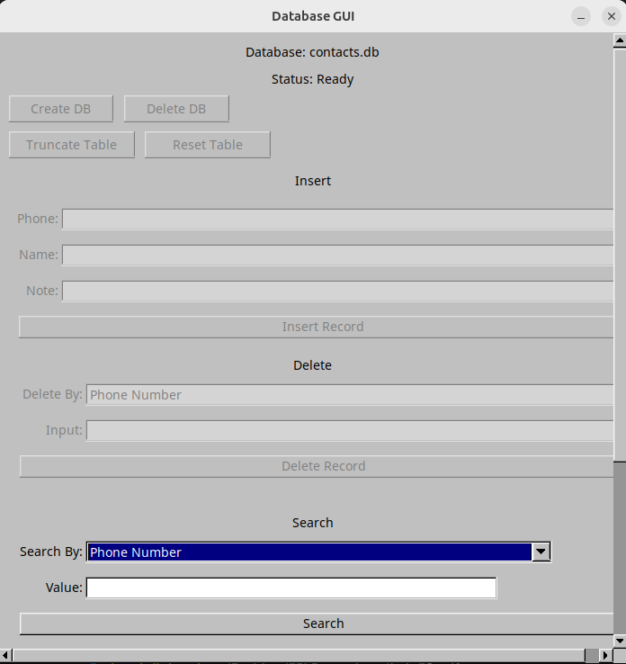
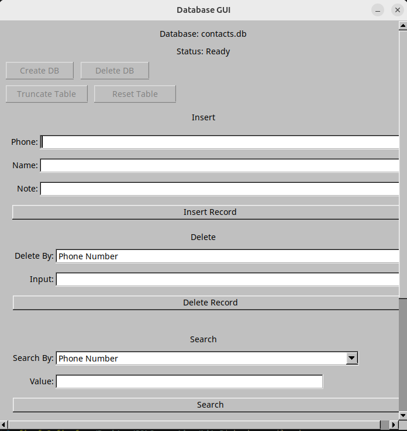
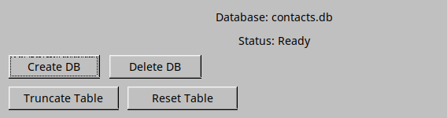
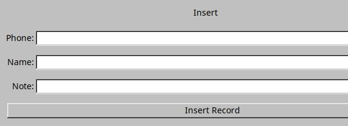
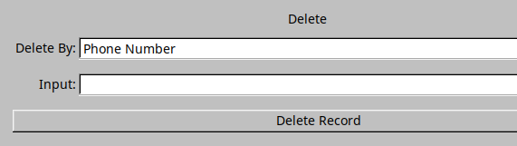
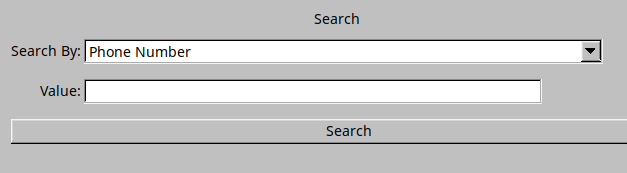

# SQLConnection

**SQLConnection** — универсальный интерфейс для работы с базами данных (SQLite/PostgreSQL) с системой ролевого доступа.
Проект предоставляет гибкое управление правами пользователей и базовыми операциями CRUD.

---

## Система прав доступа

В зависимости от роли пользователя, элементы интерфейса автоматически блокируются:

| Роль           | Доступные функции                          | Пример интерфейса                     |
|----------------|--------------------------------------------|----------------------------------------|
| **Гость**      | Только поиск данных                        |  |
| **Модератор**  | Поиск + редактирование данных              |  |
| **Администратор** | Полный доступ (создание/удаление БД, CRUD) |  |

---

## Структура проекта

Проект разделен на несколько основных модулей, каждый из которых отвечает за определенную функциональность:

### /DataBase
Этот модуль отвечает за взаимодействие с базой данных. Он содержит классы для управления подключением к базе данных (SQLite/PostgreSQL), выполнения запросов и обработки результатов. Основной класс — `SQLDatabaseManager`, который предоставляет методы для подключения к базе данных и выполнения CRUD-операций.

### /Application
Модуль `Application` содержит основную логику приложения, включая управление ролями пользователей и обработку данных. Здесь также находится класс `CoreApp`, который инициализирует приложение и управляет его жизненным циклом.

### /GUI
Модуль `GUI` отвечает за пользовательский интерфейс. Он построен с использованием библиотеки Qt и предоставляет интуитивно понятный интерфейс для взаимодействия с базой данных. В зависимости от роли пользователя, интерфейс автоматически адаптируется, блокируя или активируя определенные функции.

---

## Быстрый старт

### 1. Подключение к БД
```cpp
SQLDatabaseManager manager;
manager.connectDatabase("contacts_db"); // Автоматический выбор СУБД
```

### 2. Создание интерфейса
```cpp
CoreGUI app(800, 600, "Database Manager");
app.setUserRole(Role::Moderator); // Роль задается при запуске
app.show();
```

### 3. Пример для гостя
```cpp
// Все опасные операции заблокированы
app.insertTab->deactivate();
app.deleteTab->deactivate();
```

---

## Скриншоты интерфейса

### Интерфейс для гостя


### Интерфейс для модератора


### Интерфейс для администратора

```

---
### Взаимодействие с бд


### Вставка


### Удаление


### Поиск


---

